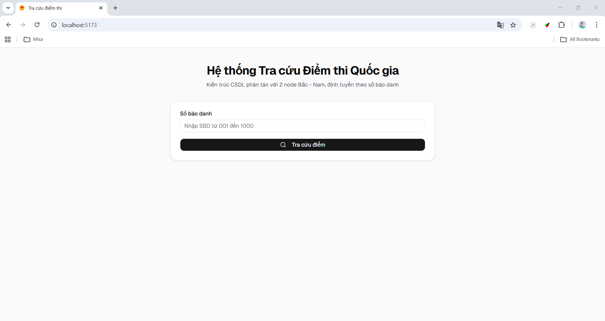

# 🎯 TraCuuDiem - Đề tài 3

## 📌 Giới thiệu

TraCuuDiem là hệ thống tra cứu điểm thi được xây dựng theo mô hình Fullstack, sử dụng cơ chế Database Sharding (phân mảnh dữ liệu) theo khu vực.

## 📸 Demo

### Trang tra cứu



---

### 📊 Phân vùng dữ liệu

- Miền Bắc: 001 → 500
- Miền Nam: 501 → 1000

---

## 🛠️ Công nghệ sử dụng

### Frontend

- ReactJS
- TypeScript
- Vite
- Axios

### Backend

- NodeJS
- ExpressJS
- mysql2
- dotenv
- cors

### Database

- MySQL (Docker)

---

## 📁 Cấu trúc thư mục

TraCuuDiem/
├── backend/
│   ├── api/
│   │   ├── controllers/
│   │   └── routes/
│   ├── config/
│   ├── .env.example
│   ├── package.json
│   └── index.js
│
├── frontend/
│   ├── src/
│   ├── .env.example
│   ├── package.json
│   └── vite.config.ts
│
├── sql/
│   ├── db_north.sql
│   └── db_south.sql
│
├── docker-compose.yml
└── README.md

---

## ⚙️ Cách hoạt động

1. Người dùng nhập số báo danh
2. Frontend gửi request đến backend
3. Backend xác định khu vực
4. Backend chọn database tương ứng
5. Trả dữ liệu về frontend

---

## 💻 Yêu cầu hệ thống

- NodeJS
- Docker Desktop (hoặc Docker Engine)
- Git

---

## 🚀 Cài đặt & chạy project

### 1. Clone project

```bash
git clone <YOUR_REPO_URL>
cd TraCuuDiem
```

---

### 2. Cấu hình môi trường

#### Backend

Tạo file: `backend/.env`

```env
PORT=3000
DB_CONNECT_TIMEOUT=4000

DB_NORTH_HOST=localhost
DB_NORTH_PORT=3308
DB_NORTH_USER=root
DB_NORTH_PASSWORD=123456
DB_NORTH_NAME=db_north

DB_SOUTH_HOST=localhost
DB_SOUTH_PORT=3307
DB_SOUTH_USER=root
DB_SOUTH_PASSWORD=123456
DB_SOUTH_NAME=db_south

CLIENT_URL=http://localhost:5173
```

---

#### Frontend

Tạo file: `frontend/.env`

```env
VITE_API_URL=http://localhost:3000
```

---

### 3. Chạy Database bằng Docker

```bash
docker compose up -d
```

Kiểm tra:

```bash
docker compose ps
```

Kết quả đúng:

- mysql_north → 3308 -> 3306
- mysql_south → 3307 -> 3306

---

### Reset database (nếu cần)

```bash
docker compose down -v
docker compose up -d
```

---

### 4. Chạy Backend

```bash
cd backend
npm install
npm run dev
```

---

### 5. Chạy Frontend

```bash
cd frontend
npm install
npm run dev
```

---

## ✅ Hoàn tất

- Frontend: http://localhost:5173
- Backend: http://localhost:3000
